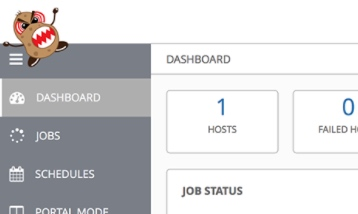
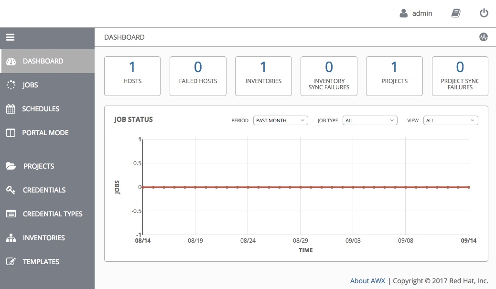

# Tired of being poked in the eye with an angry potato?

[AWX](https://github.com/ansible/awx) is a web application for additional functionality for Ansible.

To try it out, use Jeff Geerling's [great guide](https://www.jeffgeerling.com/blog/2017/get-started-using-ansible-awx-open-source-tower-version-one-minute).

The default logos are an angry potato. 

If that is what you were hoping for, great! You have nothing to do. 

But... if you would like something more subtle... consider using this minimal option. The logos are simply blank and the favicon is solid white.

## Screenshot

## Installing

If you've already installed AWX, then you just need to replace these 3 files in the 'public/static/assets/' directory.

- [favicon.ico](./awx/ui/client/assets/favicon.ico)
- [logo-header.svg](./awx/ui/client/assets/logo-header.svg)
- [logo-login.svg](./awx/ui/client/assets/logo-login.svg)

For instructions on how to incorporate these assets into the AWX build process, please view the [official installation guide](https://github.com/ansible/awx/blob/devel/INSTALL.md#awx-branding).

For help with setting up alternate AWX branding, see the [official awx-logos repo](https://github.com/ansible/awx-logos).

## Licenses

You'll want to ensure you comply with the AWX [trademark guidelines](https://github.com/ansible/awx-logos/blob/master/TRADEMARKS.md).

The font is [Changa One](https://fonts.google.com/specimen/Changa+One) under the [Open Font License](http://scripts.sil.org/cms/scripts/page.php?site_id=nrsi&id=OFL_web). 

All other contributions for this repo are under [CC0](https://en.wikipedia.org/wiki/Creative_Commons_license#Zero_.2F_public_domain), Creative Commons Zero / Public Domain.